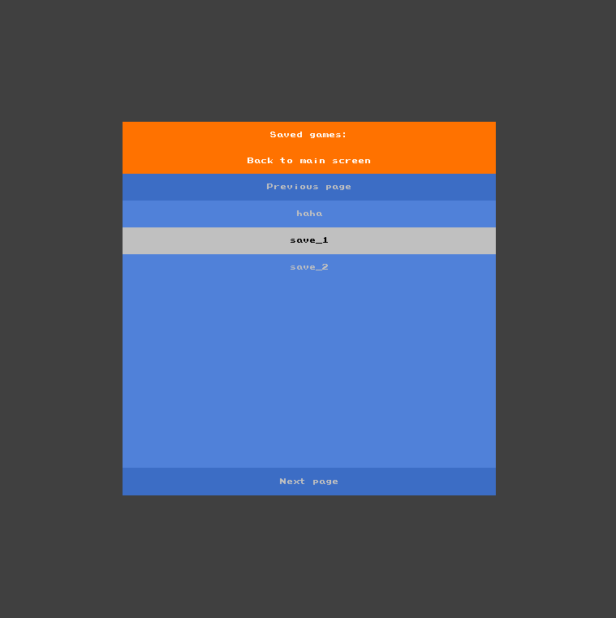

# 2048

A clone of the famous addictive game 2048.

# Installation

- Clone the repo: `git clone git@github.com:Knoblauchpilze/2048.git`.
- Clone dependencies:
    * [core_utils](https://github.com/Knoblauchpilze/core_utils)
    * [maths_utils](https://github.com/Knoblauchpilze/maths_utils)
- Go to the project's directory `cd ~/path/to/the/repo`.
- Compile: `make run`.

# General principle

This application aims at reproducing the board game [2048](https://en.wikipedia.org/wiki/2048_(video_game)) using the Pixel Game Engine. This program proposes the basic behavior of the game along with a load/save mechanism and an undo option.

# The application

The program presents several menus allowing to start a new game, load an exsiting one or play the game. Each screen can be reached when certain conditions are met.

A game over screen appears when the user loses the game (which is bound to happen) and allows to either start a new game, leave the app, or go back to the main screen.

## Main menu

The main menu allows to start a new game, load an existing one or quite the application.

## Load/save game

The load and save menu allows to search for existing data files and load an existing game to continue it.

The user can pick the game they want and the application will then load it and move to the game screen.

## Game screen

The game screen is where the user should spend the most time: it contains the main view on the game, but also some controls allowing to reset the game, display the current move and score, and also change the size of the main board.

Once in this screen, the only way out is to exit the application or lose the game.

# The Game

## Principle

The game is composed of a board with tiles having a certain value. The use ris able to merge tiles when two of them with the same value are close to one another, creating a new tile with twice the value of the two that were merged.

The user can control the board using the arrows key: a hit on the `left` key will make all tiles move to the left of the board, merging the tile that are on adjacent cells and reorganize the remaining ones starting from the left of the board.

A similar process is applied when the user hits the `right`, the `down` or the `up` key.

Additionally, a random tile with a value of `2` or `4` will be spawned at a free location in the board.

The game stops when no more moves can be done (typically when the board is full).

## Controls

The user can generate a new game with the `N` or `R` keys. This will reset the game to a new state.

One can control the moves on the board with the arrow keys. It is also possible to undo a last move (up to `5`) using the button on the status bar. We don't allow more than `5` undo operations and it is not possible to go back farther than the beginning of the game.

At any time the user can check how many moves were made and how high of a score was accumulated. The way to accumulate point is to add each newly generated tile (so merging 2 `2`s will add `4` to the score).

## Dimensions

The user can choose to play with a larger or a bigger board. The dimensions can be anything between `2x2` to `8x8`.

The buttons are disabled in case the minimum/maximum size has already been reached for one dimension.

Note that changing the size of the board will reset it.

## Serialization

TODO: Handle the serialization documentation.

